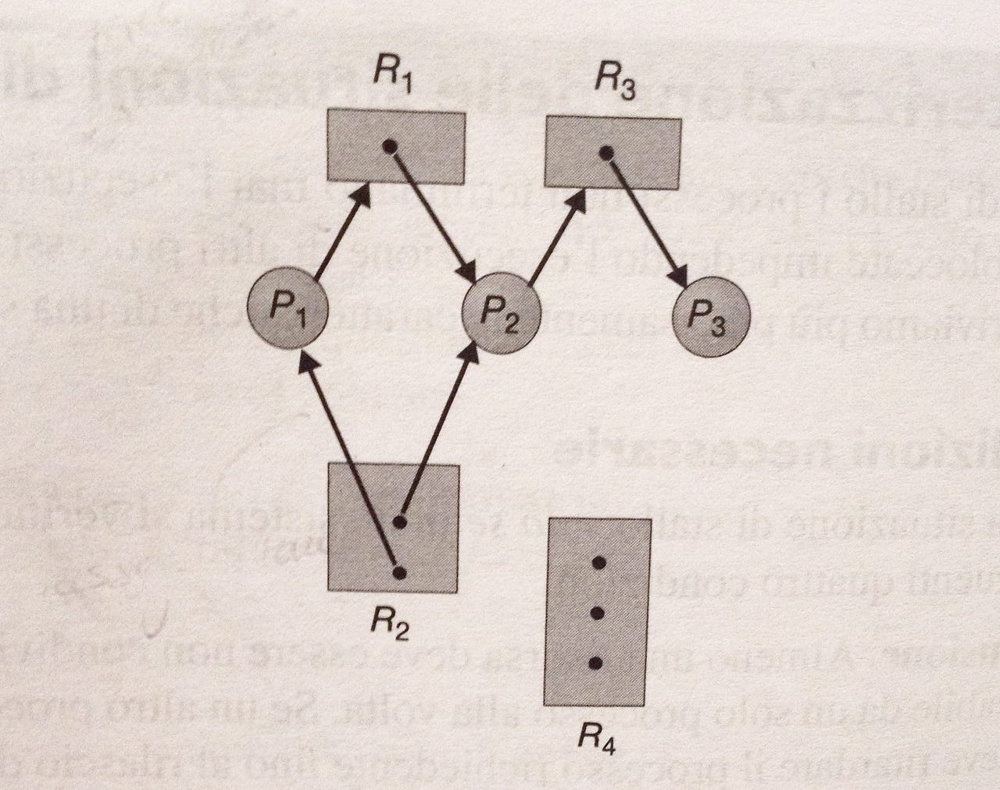

I **deadlock** nascono per problemi di *progettazione sbagliata della sincronizzazione tra processi*. In un sistema in cui vari processi usano delle ***risorse condivise*** può verificarsi deadlock tra processi concorrenti se il programmatore commette qualche errore nello schema di utilizzo risorse **richiesta ➡ utilizzo ➡ rilascio**. 

## Cosa vuol dire deadlock? 

Spesso un processo che possiede una o più risorse non le rilascia fin quando non completa l’esecuzione. Spesso per completare l’esecuzione un processo ha bisogno di altre risorse (oltre quelle che già possiede). Questo scenario porta ad una situazione in cui un gruppo di processi si mette in attesa di una risorsa occupata che non potrà mai essere acquisita perchè il processo che la occupa deve acquisire altre risorse occupate prima di rilasciare quella che già ha in uso. Le risorse restano bloccate all'interno di uno loop: un circolo di richiesta-attesa insoddisfatto in cui nessuno si muove e tutti attendono. Un deadlock può interferire sull'esecuzione di parti di programma/i, di un intero programma/i fino ad un intero sistema. 

## Stati PRONTO-ESECUZIONE-ATTESA 

Un processo è "vivo" (interagisce, esegue, richiede qualcosa ecc..) quando è in stato di ESECUZIONE (quindi fa uso della CPU). Lo stesso processo durante la sua esecuzione può aver bisogno di una risorsa. La risorsa spesso non è disponibile.

Quando il processo fa richiesta di risorsa, la risorsa se non disponibile "mette in ATTESA" il processo (fa passare involontariamente il processo nello stato di attesa) perchè diversamente il processo non può portare avanti l'esecuzione.

Far richiesta di una risorsa (aver bisogno di una risorsa) fa spostare automaticamente il processo dallo stato di ESECUZIONE allo stato di ATTESA. 

><br>Se sto chiedendo una risorsa sono nello stato di ATTESA.<br><br>

Se sto usando una risorsa posso essere nello stato di ESECUZIONE se è in corso il mio "time slice", oppure posso essere nello stato PRONTO (ready-queue) per poi passare successivamente nello stato di ESECUZIONE quando una risorsa sarà libera: le regole di scheduling-CPU gestiscono il passaggio **pronto ➡ esecuzione**. 

## Quando si verifica il deadlock

Affinché si verifichi un deadlock devono verificarsi **contemporaneamente** 4 condizioni necessarie: necessarie vuol dire che se le 4 condizioni si verificano contemporaneamente *potrebbe* verificarsi uno stallo (deadlock). Ma è anche vero che potrebbe non verificarsi nessun deaclock.

><br>Se anche una delle 4 condizioni manca, è sicuro che non c'è deadlock! <br><br>

Le 4 condizioni che realizzano un potenziale deadlock sono:

1. **mutua esclusione (mutual exclusion)** lavoro mutuamente esclusivo tra i processi: la risorsa è utilizzabile da un solo processo alla volta. 
2. **nessun rilascio anticipato (no pre-emption)** se un processo ha acquisito una risorsa nessuno me gliela può togliere (è il processo che la
lascia quando non gli serve più)
3. **attesa circolare (circular wait)** deve esserci un'attesa circolare in cui ogni processo aspetta una risorsa in possesso di un altro processo
4. **possesso e attesa (hold & wait)** deve esserci la condizione hold-and-wait ovvero il processo detiene già le risorse ma non può andar avanti perchè ne vuole altre per continuare l'esecuzione: quindi il processo è in uno stato di ATTESA con in possesso delle risorse che effettivamente tiene bloccate per se, quindi inutilizzabili da altri processi

Se queste 4 condizioni sono verificate, può verificarsi un deadklock.

## Gestire il problema del deadlock

I modi per **uscire** da un deadlock (gestire il problema deadlock) sono di 2 tipi, *prevenzione* e *rilevazione-ripristino*:

1. **prevenzione** garantisce che il deadlock non si verificherà mai. Prevenire vuol dire *garantire* che almeno una delle 4 condizioni, che provocano lo stallo, **non** si verifichi. Le risorse libere tendono a non essere utilizzate per la "paura" di incorrere in una delle 4 condizioni precedenti. Importante notare che per **realizzare** un metodo di prevenzione è necessario sprecare anche in questo caso delle risorse (risorse che servono per realizzare il metodo di prevenzione). Ciò, oltre ad aumentare la complessità di gestione dei processi, produce uno scarso utilizzo dei dispositivi e riduce la produttività.

2. **rilevazione-ripristino** notifica l'utente che il deadlock può verificarsi e quando si verifica in qualche
modo l'utente se ne accorge e lo risolve. **Risolvere** vuol dire fare un **roll-back** su uno o più processi.
Roll-back vuol dire perdere il lavoro fatto fino al verificarsi del deadlock, quindi aver sprecato tempo
e uso delle risorse.

Quindi in entrambi i casi ci sono vantaggi e svantaggi. 
 
<div markdown="1" style="border: solid 1px #aaa; padding: 3em; padding-top: 1.5em; padding-bottom: 1.5em; margin-top: 2em; margin-bottom: 2em;">

### Deadlock e ambienti safaty-critical e non safety-critical.

La prevenzione è una situazione fondamentale nei sistemi **"safety-critical"** dove è necessario che i processi vengano eseguiti fino alla loro conclusione (es: partenza shuttle, transazioni ATM, sistema raffreddamento nocciolo reattore nucleare ecc...). In questi sistemi, anche se ha un costo, la prevenzione deve essere fatta perchè diversamente non si hanno soluzioni. 

><br>La prevenzione garantisce di non incorrere in deadlock!<br><br>

Se il sistema è **non safety-critical** posso preferire le prestazioni lasciando che il sistema usi tutte le risorse disponibili, poi quando si verifica il deadlock si farà roll-back (perderò il lavoro fatto dalla comparsa del deadlock).

In contesti dove il deadlock non è assolutamente critico vi è la possibilità di usare l'**algoritmo dello struzzo**, ovvero l'utente che si accorge di un deadlock può "uccidere" un processo o nel peggiore dei casi riavviare il sistema.  
</div>

### Prevenzione: come realizzarla per evitare il deadlock

Per prevenire il deadlock ci sono 2 strategie, la prevenzione statica e quella dinamica:

1. **prevenzione statica** è una regola in cui tutti i processi devono sottostare, indipendentemente dalle richieste del processo. Da subito il processo deve seguire le regole della prevenzione statica, che lavora per ***realizzare la violazione di una delle 4 condizioni che portano a deadlock*** (in realtà sono violabili solo 3 condizioni perchè la mutua esclusione non può essere violata, per cui si lavora solo sulle 3 condizioni restanti):
	
	1. realizzare la prevenzione statica per prevenire la condizione **hold-and-wait** si attua imponendo al processo di prendere **tutte** le risorse (necessarie per portare a termine l'esecuzione) prima di iniziare la sua esecuzione. Quindi si ha solo l'evento "hold" (tenere) delle risorse, mentre il "wait" non si verificherà perchè le risorse sono già a disposizione del processo (avendole già prese prima di iniziare la sua esecuzione). Può provocare **starvation**, ossia che il processo in esecuzione ci rimane per lungo tempo, non liberando così le risorse necessarie anche ad altri processi. 

	2. realizzare la prevenzione statica per evitare il vincolo del **non-premptive** sulle risorse (usare le risorse fino a quando il processo vuole), ovvero se il processo va in stato di ATTESA deve lasciare tutte le risorse che aveva acquisito.

	3. realizzare la prevenzione statica per prevenire la **circolarità** gestendo le risorse con ordine monotono di priorità. In pratica **ad ogni risorsa viene assegnata una priorità di esecuzione** mentre **ad ogni processo viene imposto di chiedere le risorse seguendo un ordine crescente di numerazione**. Quindi all'inizio un processo può chiedere una risorsa con qualsiasi numero di priorità e succesivamente può richiedere un'altra risorsa solo se quest'ultima ha un valore di priorità maggiore. 

	Con la prevenzione statica si ha un **basso uso delle risorse** (per via dei modi con cui si accede alle risorse per realizzare la prevenzione). 

2. **prevenzione dinamica** analizza caso per caso. ***Ogni richiesta fatta dal processore viene valutata*** e si decide a run-time come comportarsi. Prevede 2 tipi di **valutazione** delle richieste:
	
	1. valutazione con **algoritmo con RAG** (grafo ciclico delle risorse): è un aloritmo che prevede L'USO DEL RAG. È efficiente (risponde velocemente) ma funziona solo se si ha ***un'unica istanza per ogni tipo di risorsa***; diversamente non è utilizzabile. Al processo si concede una risorsa solo se questa non crea un loop (ciclo di richiesta risorse che **potenzialmente porta a deadlock**, quindi siamo in uno stato **non-sicuro**). Oltre agli *archi di richiesta* ed *assegnazione* tipici del RAG, l’algoritmo usa un ***arco di reclamo*** (linea tratteggiata) dove indica che il processo può richiedere la risorsa in qualsiasi momento (non si tratta quindi di una iniziativa di richiesta ma indica una potenziale possibilità di ottenere la risorsa se le condizioni permettono di non creare un loop). Assegnare o meno la risorsa è compito dell’algoritmo. La linea tratteggiata va dal processo alla risorsa e si inverte la direzione (diventando linea continua) se la risorsa viene poi assegnata al processo (qui ci troviamo in uno stato **sicuro**). Il reclamo di una risorsa va fatto prima che il processo entri in esecuzione.
	
	2. valutazione con **algoritmo del banchiere**: ha maggiore complessità (quindi risponde più lentamente) e si usa in un contesto **dove il numero di istanze per ogni tipo di risorsa può essere maggiore di 1** (situazione più generica). L'algoritmo è composto da 2 tipi di algoritmi: 

		* **algoritmo di allocazione**
		* **algoritmo di verifica dello stato**

	Entrambe gli approcci ("algoritmo con RAG" e "algoritmo del banchiere") richiede a priori che il SO **conosca esattamente il n.ro massimo di risorse** che ogni processo userà durante la sua vita nel caso pessimo (= caso in cui dovrà sfruttare il n.ro massimo di risorse per terminare l'esecuzione).

	><br>Nella prevenzione dinamica il SO conosce esattamente il n° max di risorse che il processo userà da inizio a fine esecuzione! <br><br>

	Purtroppo conoscere a priori le risorse che un processo andrà ad usare durante la sua vita, è un'informazione che spesso non è nota. Perciò **non è possibile usare algoritmo con RAG o il banchiere** in programmi che possono cambiare durante l'esecuzione a seconda degli input provenienti dall'esterno, ovvero di programmi che avanzino la possibilità che un processo possa chiedere poche o tante risorse. Sono quindi algoritmi poco usati. 

	Anche l’uso della prevenzione dinamica ha **basso uso delle risorse**. 

<div markdown="1" style="border: solid 1px #aaa; padding: 3em; padding-top: 1.5em; padding-bottom: 1.5em; margin-top: 2em; margin-bottom: 2em;">

### RAG (approfondimento).

Il RAG è un modo grafico per poter rappresentare/descrivere le situzioni di stallo. Il RAG è un insieme di nodi e archi.
I nodi posso collegarsi tra loro tramite l'uso degli archi. L'immagine sotto è un esempio di deadlock!



I nodi (insieme **V**) sono costituiti da: 

* **cerchi** = processi (CPU; I/O, memoria)
* **rettangoli** = risorse. Ogni risorsa ha un pallino rappresentante l'istanza: 2 pallini = 2 istanze della risorsa.

Gli archi (insieme **E**) possono direzionarsi cosi: 

* da processo a risorsa: vuol dire che il processo sta richiedendo una risorsa.
* da risorsa a processo: vuol dire che il processo detiene una risorsa. 

Dall'immagine sopra si ha che:

* ```V = {(P1,P2,P3), (R1,R2,R3,R4)} ```
* ```E = {(R1,P2), (P1,R1), (R2,P1),(R2,P2), (R3,P3),(P2,R3)}```

ma la relazione tra i nodi (la direzione degli archi), può cambiare in fase di **richiesta->acquisizione->rilascio** delle risorse.

### Stato sicuro e stato non-sicuro (approfondimento).

Il sistema si trova in uno stato sicuro (**safe**) se le risorse sono assegnate ai processi senza che si verifichi il deadlock (viene garantita che non si verifichi la condizione di *circula wait*, una delle 4 condizioni da violare per evitare il deadlock). In parole povere è una sequenza di allocazione risorse che permette a tutti i processi di usare le risorse per **poter terminare la loro esecuzione**. Le risorse, che verranno assegnate con una certa sequenza, andranno a formare una **sequenza sicura** di esecuzione processi. 

Se non esite una *sequenza sicura* allora il sistema si trova in uno stato non sicuro (**unsafe**). Una sequenza di processi può vivere in uno *stato non sicuro* senza cadere in deadlock, ma potrebbe anche incontrare un deadlock senza preavviso. 


<blockquote markdown="1" style="border: solid 1px #00b8d4; border-left: 5px solid #00b8d4; background: #00b8d40a; padding: 20px; border-radius: 5px; font-size: 14px;">
Definire una sequenza sicura o non sicura è compito degli algoritmi di **prevenzione dinamica** (*algoritmo con RAG* e *algoritmo del banchiere*) .
</blockquote>

Una sequenza di processi è una *sequenza sicura* quando **ogni** processo della sequenza può *richiedere e ottenere* una o più risorse e, una volta ottenute, terminare. Le risorse, che il processo può richiedere e ottenere, sono quelle disponibili (non assegnate a nessuno) più quelle del processo che, avendo terminato prima di lui l'esecuzione, ha liberato le risorse usate. Se un processo non trova le risorse libere, può rimanere in attesa e prendere le risorse quando disponibili, perchè in questo contesto prima o poi si libereranno dato che non esiste l'attesa circolare.

<blockquote markdown="1" style="border: solid 1px #00b8d4; border-left: 5px solid #00b8d4; background: #00b8d40a; padding: 20px; border-radius: 5px; font-size: 14px;">
Una sequenza safe (sicura) non porterà **mai** a deadlock perchè viene violata la condizione di attesa circolare (circular wait), che non si verificherà.
</blockquote>

Ricordiamo che si tratta di *prevenzione dinamica* in cui il SO conosce a priori il n.ro massimo di risorse che ogni processo userà durante la sua vita. Per cui quando si è in uno stato non-sicuro il SO non riesce ad impedire al processo di chiedere le risorse per raggiungere il massimo dichiarato. Questo comportamento potrebbe condurre al deadlock perchè ciò che accade nello stato non-sicuro dipende da come si comporta il processo stesso quando rilascia o richiede risorse. 

<blockquote markdown="1" style="border: solid 1px #00b8d4; border-left: 5px solid #00b8d4; background: #00b8d40a; padding: 20px; border-radius: 5px; font-size: 14px;">
Non tutti gli stati unsafe (non-sicuri) portano a deaklock, ma da uno stato *unsafe* posso andare in deadlock.
</blockquote>


</div>

### Rilevazione-ripristino: scovare il deadlock e ripristinare il sistema.

Quando un SO **non fa uso** degli algoritmi di prevenzione vuol dire che non previene il deadlock e può incontrarlo in qualsiasi momento. Se il deadlock interferisce su parte del sistema, senza bloccarlo completamente, si può agire come segue rilevando il deadlock e successivamente ripristinaer il sistema: 

1. **Rilevazione**. Usare un algoritmo che sia in grado di **rilevare** il deadlock, esaminando il sistema.

    * **Rilevazione e ripristino tramite RAG** (istanza singola di ciascun tipo di risorsa): funziona correttamente solo se tutte le risorse del sistema hanno **una sola istanza** (come nella *prevenzione dinamica*). Per individuare un deadlock si va ad analizzare una variante del RAG chiamato **grafo di attesa** che a differenza del RAG contiene solo i processi collegati tra loro dagli archi: non ci sono i nodi delle risorse. Il sistema *mantiene costantemente aggiornato* il grafo di attesa. Durante l'analisi è *invocato periodicamente un algoritmo* per cercare un ciclo all'interno del RAG.

		<blockquote markdown="1" style="border: solid 1px #00b8d4; border-left: 5px solid #00b8d4; background: #00b8d40a; padding: 20px; border-radius: 5px; font-size: 14px;">
		Un vantaggio di questo metodo è il **non dover conoscere in anticipo** richieste necessarie. <br>
		Uno svantaggio è il costo elevato del recovery.
		</blockquote>

    	Nell'immagine sotto: (a) RAG - (b) Grafo di attesa risorse
    
    	

    * **Algoritmo di rilevazione** (più istanze di ciascun tipo di risorsa): se vi è più di una istanza per risorsa, non è possibile usare l'algoritomo *Rilevazione e ripristino tramite RAG*, ma si usa l'*algoritmo di rilevazione*. Questi verifica tutte le possibili sequenze di assegnazione risorse per i processi che non hanno ancora terminato. Se a fine verifica si ha una *sequenza safe* non ci sarà deadlock. È simile all'*algoritmo del banchiere*. 

    L'*algoritmo di rilevazione* si usa considerando la presunta **frequenza** con la quale un deadlock si verifica e il **numero** dei processi influenzati da un deadlock. Viene richiamato ad **ogni richiesta risorsa** e, come altrnativa meno dispensiosa, potrebbe essere richiamato ad **intervalli di tempo** oppure quando si hauna drastica riduzione dell'uso CPU dovuto ad un deadlock (che di norma rende inefficiente le prestazioni del sistema).

2. **Ripristino**. Usare un algoritmo che in caso di deadlock, **riporti il sistema ad uno stato precedente** al deadlock.

    * **Terminazione dei processi** (uccisione): è possibile terminare **tutti i processi** per interrompe il deadlock ma si perde il lavoro (magari di molti calcoli) già svolto dai processi ed inoltre se il processo prima del deadlock stava aggiornando un programma o un file, terminare vuol dire comprometterne l'uso. È possibile anche terminare un **processo alla volta** fin quando il deadlock viene interrotto, ma si genera *overhead* perchè ad ogni terminazione processo bisogna invocare l'*algoritmo di rilevazione* per vedere se ci sono altri processi che provocano deadlock.
    
    * **Prelazione delle risorse dai processi bloccati nel deadlock**: è possibile sottrarre le risorse in successione a processi **selezionati** e darle ad altri processi in modo da interrompere il deadlock. Si selezionano perché è necessario capire come gestire il processo che subisce la prelazione, dal momento che perderebbe tutto il lavoro fatto risultando essere uno spreco di risorsa. Inoltre bisogna definire se salvare lo stato del processo da prelazionare (rollback), in modo da riprenderlo sucessivamente, o se terminare il processo e riavviarlo in seguito. Il rollback è efficace ma dispendioso in risorse. Per finire bisogna assicurare che le risorse non vengano sottratte sempre allo stesso processo.