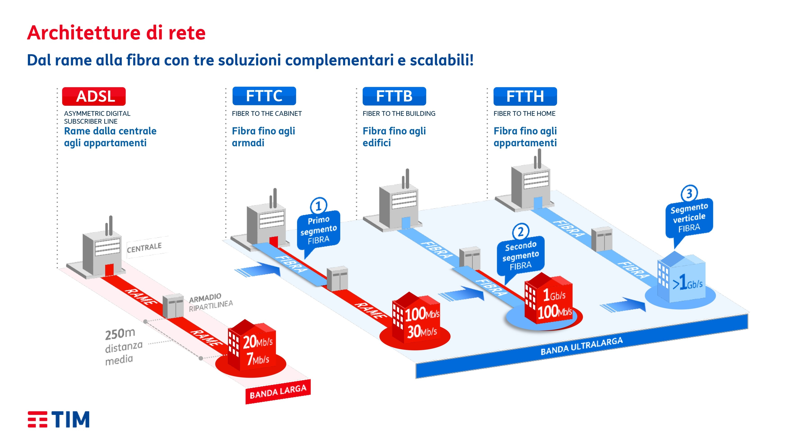
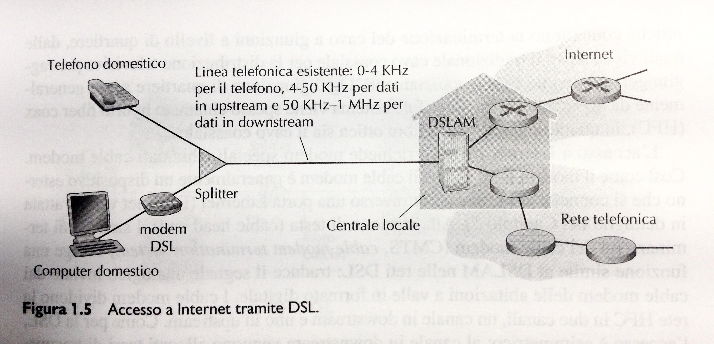
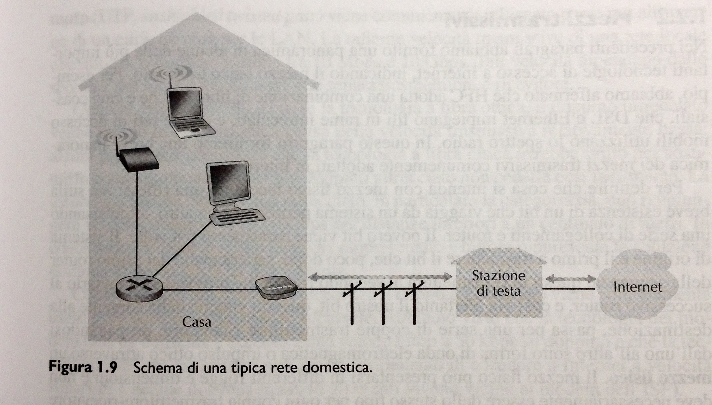
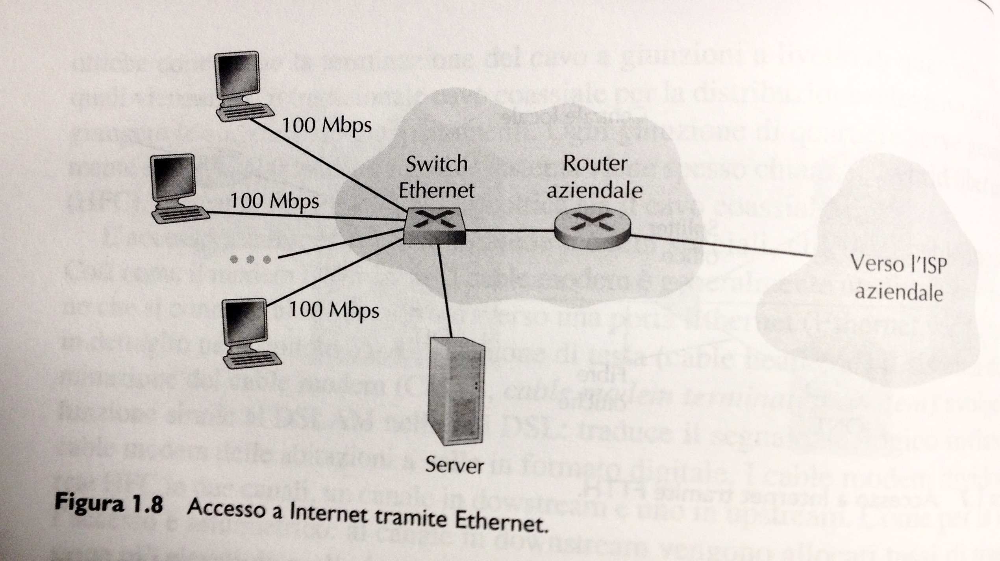

Sono reti che contegono gli host e sono definite come le reti più esterne nella logica dell'infrastruttura internet. Tali reti dovranno collegarsi a reti gerarchicamente più "interne" che servono per far si che i messaggi che partono da un host di una rete raggiungano un host presente in una rete diversa e lontana svariati chilometri. 

Le reti di accesso sono: residenziali, aziendali e di accesso mobile. Quelle residenziali sono le tipiche reti casalinghe che fanno uso della linea telefonica per accedere ad internet. Tale connessione tipicamente avviene con l'uso della tecnologia **DSL** che fa uso del doppino telefonico per comunicare con il DSLAM presente all'interno di una compagnia telefonica o negli armadi di ripartizione presenti ai bordi delle strade. 

Se il cablaggio tra abitrazione e compagnia telefonica è solo su doppino telefonico, si ha l'ADSL pura. Se il cablaggio da casa fino all'armadio di ripartizione è su doppino telefonico e dall'armadio alla centrale della compagnia telefonica è in fibra, si ha FTTC (Fibre To The Cabinet). Se il cablaggio dall'abitazione verso l'armadio di ripartizione è in fibra e dall'armadio alla centrale di una compagnia telefonica è anche in fibra ottica, si parla di tecnologia FTTH (Fibre To The Home).

I dati digitali provenienti da un host (es. PC) per essere inviati sul doppino telefonico devono essere convertiti in **toni** ad alta frequenza. Questa conversione è svolta dal **modem DSL** presente nelle abitazioni. A seguito della trasmissione dei toni sul doppino, questi arrivano al DSLAM che li riconverte in segnale digitale per viaggiare su cablaggi ad alta velocità. 

**Nota**: lo schema sotto permette di connettere un solo host ad internet e lo splitter è lo sdoppiatore telefono/modem (splitter DSL) che si inserisce sulla presa del telefono di casa.

Le linee residenziali trasportano sia dati che segnali telefonici. Quindi sul segmento che va dall'abitazione al DSLAM si hanno tre bande di frequenza diverse e non sovrapposte: una per il downstrem, uno per upstream e uno per il canale telefonico tradizionale a due vie. Quindi connessione internet e chiamata telefonica condividono lo stesso collegamento. Il DSLAM separerà i segnali dati dai segnali telefonici, inviando i primi verso la rete internet e i secondi verso la rete telefonica. 

Per permettere a più utenti di un'abitazione di connettersi in contemporanea su internet, è necessario usare un router all'interno della rete residenziale. 

**Nota**: nell'immagine sotto manca lo splitter DSL telefono/modem.

Quando nella rete residenziale si ha si fa uso dell'FTTH, in casa non si ha più il modem DSL ma si usa l'ONT (Optical Network Terminator) e nell'armadio di ripartizione si ha lo Splitter Ottico che combina più abitazioni su in una singola fibra ottica che si connette all'OLT (Optical Line Terminator) presente nella centrale della compagnia telefonica che converte i segnali ottici ed elettrici e li direziona verso un router connesso ad internet. 

Le reti di accesso aziendale fanno uso tipicamente della tecnologia ethernet. All'interno della rete gli hosts sono connessi ad uno switch connesso a sua volta ad un router aziendale che si allaccia direttamente alla rete del'ISP per l'accesso ad internet.

Le reti ad accesso mobile sono le reti con tecnologia WiFi che permettono di creare reti **LAN wireless** e **accesso wireless su scala geografica**. Le prime sono realizzabili con l'ausilio di stazioni base chiamate *access point* dalla dimensione contenuta e si usano in ambienti residenziali, aziendali e commerciali. Le seconde sono realizzabili con l'ausilio di stazioni base tipo antenne radio di dimensione più sostenute e permettono un raggio di copertura maggiore, usato per per l'accesso con dispositivi quali smartphone o altro. 