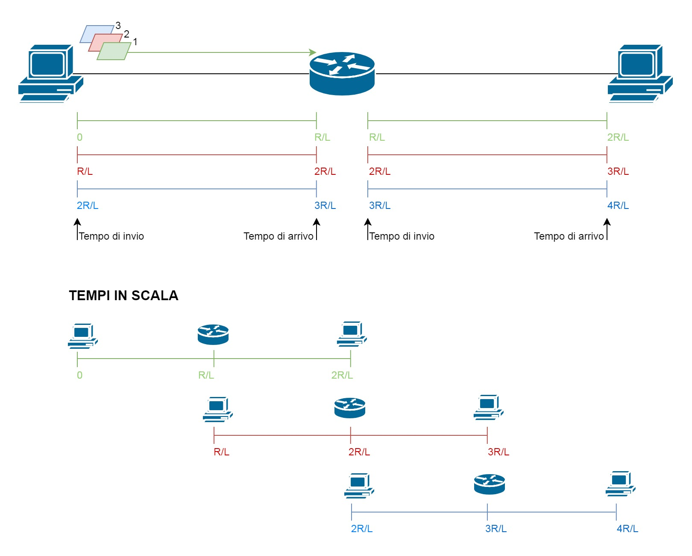

In [precedenza](la-rete-di-accesso "Articolo sulla rete di accesso") si è trattata la parte *periferica* della rete internet. Ora vediamo la parte interna denominata *nucleo*: qui si hanno i dispositivi che permettono lo scambio dei messaggi tra vari host appartenenti alla stessa rete e o a *reti differenti*. 

### Store-and-forward

È stato accennato che i *commutatori di pacchetto* (router e switch), insieme alla *rete di collegamento*, sono parte integrante di internet. Questi sono i dispositivi del nucleo della rete. Router e switch sono **commutatori di pacchetto** che usano la **trasmissione store-and-forward** dove il commutatore **deve ricevere tutto il pacchetto prima di trasmetterlo sul collegamento in uscita**.

Router e switch, mentre ricevono un pacchetto, immagazzinano i suoi bit all'interno di un **buffer** e quando sarà ricevuto tutto il pacchetto questi verrà trasmesso sul collegamento in uscita. Se il pacchetto non trova un buffer a disposizione perchè tutti pieni, viene scartato. 

>**Store-and-forward** 
>Un commutatore di pacchetto (router o switch) deve ricevere l'intero pacchetto prima di poterlo trasmettere sul collegamento in uscita.

I pacchetti vengono trasmessi su di un collegamento alla velocità del collegamento stesso. Il **tempo di trasmissione** su un singolo collegamento dipende quindi dalla dimensione **L** del pacchetto (in bit) e dalla velocità di trasmissione **R** del collegamento (in bps): **L/R**. Il tempo di trasmissione è il tempo richiesto per trasmettere tutti i bit sul collegamento.

>Tempo di trasmissione = dimensione pacchetto/velocità collegamento = L/R

Se il pacchetto per raggiungere la destinazione deve passare 2 collegamenti, il tempo di trasmissione sarà 2*L/R per ogni singolo pacchetto.

**NOTA.** nell'esempio precedente per semplicità vengono considerati SOLO i tempi di invio. Altri tempi influiranno sul reale tempo di trasmissione di un pacchetto. 

**NOTA 2.** Il tempo di trasmissione viene considerato anche come **ritardo di trasmissione** o **ritardo store-and-forward**, perchè effettivamente L/R è il tempo che impiega il pacchetto durante il viaggio per arrivare a destinazione. In un percorso con N collegamenti si hanno N-1 Router. Nell'esempio precedente si hanno 2 collegamenti per cui router=1.

Possiamo calcolare quindi il ritardo da PC a PC chiamato **Ritardo end-to-end** (qui non sono considerati i ritardi di elaborazione e propagazione trattati più avanti): 

	R end-to-end = N(R/L)

Nell'esempio precedente il ritardo e-to-e è 2R/L ossia il tempo di trasmissione effettivo su due collegamenti.
